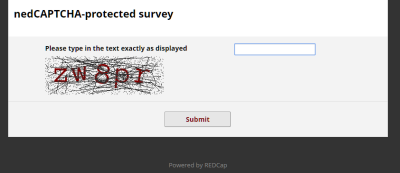

# nedCAPTCHA

A REDCap External Module that adds CAPTCHA protection to public surveys without any dependencies on external services (hence the name ned = **n**o **e**xternal **d**ependencies).

## Purpose

To protect a public survey with a CAPTCHA. While REDCap 8.11.0 and newer provides Google reCAPTCHA as an integrated service, this may not be suitable in all circumstances (e.g. servers with tight IPTABLES firewall or privacy rules, where sharing user IPs with Google is problematic).

## Effect

When enabled in a project, the module will protect the public survey with a CAPTCHA (either a classic image CAPTCHA with distorted text, a math problem, or a custom challenge). A user will first have to complete the CAPTCHA challenge before being allowed to proceed to the survey. The captcha has to be completed at most once per user session.



The _Custom_ CAPTCHA option could be used to implement simple password protection of a survey. Only users who know the "password" can then access the survey.

## Requirements

- REDCap 11.1.5 or newer.
- The GD library **with FreeType** support must be installed in PHP.

## Installation

- Clone this repo into `<redcap-root>/modules/redcap_nedcaptcha_v<version-number>`, or
- Obtain this module from the Consortium [REDCap Repo](https://redcap.vanderbilt.edu/consortium/modules/index.php) via the Control Center.
- Go to _Control Center > Technical / Developer Tools > External Modules_ and enable 'nedCAPTCHA'.
- Enable in projects that require public survey protection.

## Configuration

### System-Level Settings

- **Global - Debug Mode:** When enabled, some debug information will be printed to the Web-browser's console. This setting is global, i.e. debug info will be shown regardless of the debug setting in a project.

### Project-Level Settings

- **Debug Mode:** When enabled, some additional information that may help troubleshooting will be printed to the Web-browser's console.

- **Show error messages in the browser:** When enabled, error messages such as PHP exceptions are shown in the browser at the top of survey pages.

- **Always require the CAPTCHA to be answere:** When checked, the CAPTCHA will be presented on each (repeat) survey, even when the request originates from the same browser.

- **CAPTCHA Type:** Sets the type of CAPTCHA that is used to protect the public survey.
  - _None:_ The CAPTCHA is deactivated.
  - _Simple Math Problem:_ A math problem will need to be solved to get to the survey. Solutings are never negative. The problem is shown as an image.
  - _Distorted Text Image:_ A sequence of digits/letters has to be entered exactly as shown in the displayed image.
  - _Custom:_ Custom challenge-response pairs can be set.

_Math-specific settings:_

- **Complexity:** Can be set to _'Simple'_ or _'Complex'_. Simple problems will be limited to additions, while complex problems include two of addition, subtraction, and multiplication (however, there will never be two multiplications, as results can get quite large).

- **Minimum / Maximum operand values:** Sets the range of operand values. By default, the range of operand values is 1 to 10. In complex problems, the first operand my be set to a higher value to ensure a non-negative results when subtractions are present.

_Image-specific settings:_

- **Length:** The length of the challenge text (defaults to 6 characters).

- **Challenge reuse:** By default, a new challenge is recreated for each try. By enabling this option, in case of retries, the same challenge is reused.

- **Angle variation:** Determines the amount of random rotation that is applied to individual characters. Can be set to _'None'_ (no rotation), _'Slight'_ (up to ±7°), _'Medium'_ (up to ±11°; this is the default setting), or _'Strong'_ (up to ±15°).

- **Noise density:** Determins the amount of noise that is added to the image: _'Off'_ (no noise), _'Low'_ (a low amount of noise, 60% of the default amount), _'Medium'_ (the default amount), or _'High'_ (150% of the default amount).

_Color settings (math and image CAPTCHAs):_

For math and image CAPTCHAs, text and background colors (in case of image CAPTCHAs also the color or the added noise) can be set. To do so, enter a color value either as triplets of comma-separated integers (0-255) or as hex values (with or without leading #): e.g. the color red could be specified as `255,0,0` or `#ff0000`.

_Custom-specific setting:_

- **Challenge-response pairs:** Enter pairs of challenges (displayed to the user) and response (the expected answer), separated by the equal sign (=), one pair per line. For the CAPCHA, a random pair will be chosen each time. Answers are **not** case-sensitive.  Examples:

  ```text
  The color of the sky? = Blue
  The color of grass? = Green
  Snowwhite and the __?__ dwarves (enter as text). = Seven
  ...
    ```

  ```text
  Type the access key to proceed. = secretaccesskey
  ```

_Customization of text elements of the CAPTCHA page:_

- _Introduction:_ This is displayed immediately below the survey title. By default, this is blank.

- _Label:_ The label of the CAPCHA (displayed abouve the challenge). Default values vary by CAPCHA type (_Math:_ 'Please solve this math problem:', _Image:_ 'Please type in the text exactly as displayed', _Custom:_ none).

- _Button:_ The label of the submit button (defaults to 'Submit').

- _Fail message:_ The message that is shown upon failure to solve the CAPTCHA (shown below the submit button; defaults to 'Validation failed. Please try again.').

## Testing

Instructions for testing the module can be found [here](?prefix=redcap_nedcaptcha&page=tests/nedCAPTCHAManualTest.md).

## Changelog

Version | Changes
------- | -----------
1.2.0   | Requires EM Framework version 8 (REDCap 11.1.5)
1.1.0   | Add "Always ask" option.<br>Bugfix: Debug mode was not working as intended.
1.0.6   | Re-Fix: Prevent "hook not completed" error.
1.0.5   | Bugfix: Prevent "hook not completed" error.
1.0.4   | Updated behavior: Query params for setting fields is now supported (no need for _startover any longer).
1.0.3   | Add the GD + FreeType requirement to the documentation. Improved error handling.
1.0.2   | Add instructions for testing the module.
1.0.1   | Bug fixes.
1.0.0   | Initial release.
